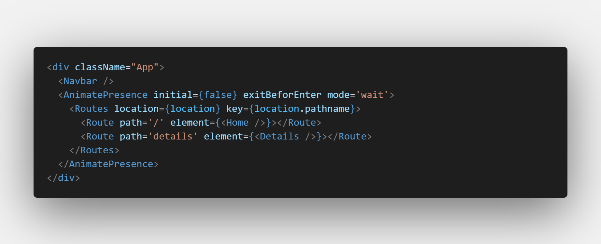
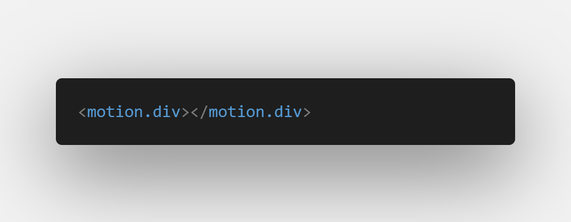
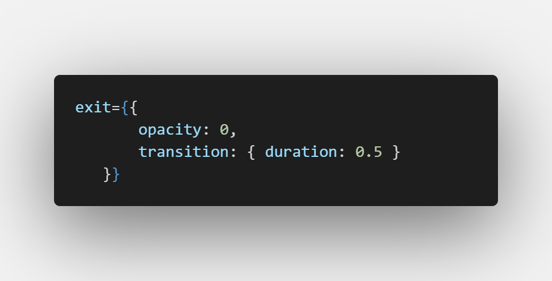
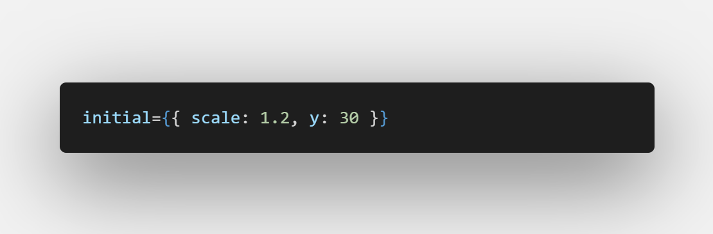
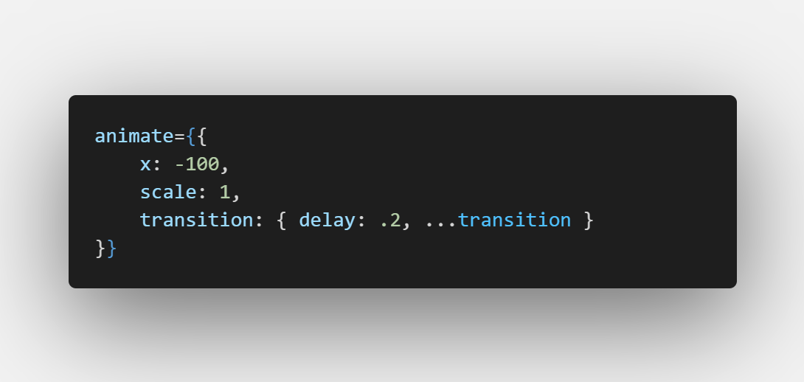

# Framer-motion page transition
Framer Motion is a production-ready motion library for React from Framer.
It's simple yet powerful, allowing you to express complex user interactions with robust, semantic markup. 

In this project I utilized Framer Motion and react-router-dom for a cool page transition

## Processes

- First of all we start by installing framer motion and react-router-dom into your react project
npm install framer-motion
npm install react-router-dom

- Secondly navigate to your app.jsx file and import some modules from both libraries you installed earlier
framer-motion and react-router-dom, below are the modules you would be importing.
    - Routes from react-router-dom
    - Route from react-router-dom
    - useLocation from react-router-dom
    - AnimatePresence from framer-motion

    - import {Route, Routes, useLocation} from 'react-router-dom'
    - import {AnimatePresence} from 'framer-motion'

After you are done your app.jsx should look like this:

- Thirdly navigate to your home page (the page you would like to transition from)
motion is another framer-motion module you would install but you will do so in the home page
    - import {motion} from framer-motion

- Then we add motion to every element you would like to animate, it should look like this

So now we can start adding the animations

In other to animate out of a page, framer-motion has a property called (exit) and it can be used to define the kind of animation an element should have if the user switches pages, for example:

in the example in the image above, when the user switches pages the element with the exit property fades out with a duration time of 0.5s.

- framer-motion also has other properties like the initial, like the name suggest the initial property is used to set the behaviour of an element before the main animation starts, for example

in this example, after you have animated out of the home page using the exit property, and into the new page, an element in the new page is set to initially be at a scale of 1.2 and 30px towards the bottom(y:30)

- Another property is the animate property and it is used to define the actual animation of the element, for example

In this example, the element in the new page with the animate property is set to animate -100px towards the left(x: -100) at normal scale (scale: 1) and is to start the animation after 0.2s.

